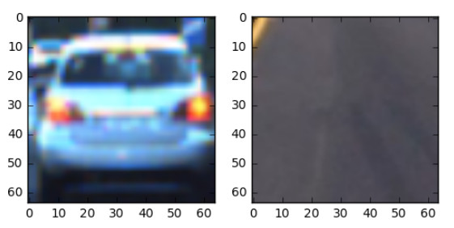

## Vehicle Detection Project

The goals / steps of this project are the following:

* Perform a Histogram of Oriented Gradients (HOG) feature extraction on a labeled training set of images and train a classifier Linear SVM classifier
* Optionally, we can also apply a color transform and append binned color features, as well as histograms of color, to our HOG feature vector. 
* Note: for those first two steps don't forget to normalize your features and randomize a selection for training and testing.
* Implement a sliding-window technique and use your trained classifier to search for vehicles in images.
* Run your pipeline on a video stream and create a heat map of recurring detections frame by frame to reject outliers and follow detected vehicles.
* Estimate a bounding box for vehicles detected. 

### Histogram of Oriented Gradients (HOG)

#### 1. Explain how (and identify where in your code) you extracted HOG features from the training images.

The code for this step is contained in lines 32 through 53 of the file called `1_train.py`.  

I started by reading in all the `vehicle` and `non-vehicle` images.  

```python
carimages = glob.glob('dat/vehicles/**/*.png', recursive=True)
noncarimages = glob.glob('dat/non-vehicles/**/*.png', recursive=True)
cars = []
notcars = []
for image in carimages:
    cars.append(image)
for image in noncarimages:
    notcars.append(image)
```

Here is an example of one of each of the `vehicle` and `non-vehicle` classes:



I then explored different color spaces and different `skimage.hog()` parameters (`orientations`, `pixels_per_cell`, and `cells_per_block`).  I grabbed random images from each of the two classes and displayed them to get a feel for what the `skimage.hog()` output looks like.

Here is an example using the `RGB` color space and HOG parameters of `orientations=9`, `pixels_per_cell=(8, 8)` and `cells_per_block=(2, 2)`:


#### 2. Explain how you settled on your final choice of HOG parameters.

We tried various combinations of parameters and color spaces. We found out that the combination of `orientations=9`, `pix_per_cell = 6 or 8`, `cell_per_block = 2 or 3` results in a good performance and `color_space = HSV or HLS` are also good ones. So, we ended up having  `orientations=9`, `pix_per_cell = 8`, `cell_per_block = 2`, and `color_space = HLS`.


#### 3. Describe how (and identify where in your code) you trained a classifier using your selected HOG features (and color features if you used them).

We trained a linear SVM using our selected HOG and color features. First, we stack all features and normalize them. For labels, we set one and zero to car and not-car images, respectively. Once the dataset is prepared, we split it into training and validation datasets with random selection applied. We use `train_test_split` function from the `sklearn` library. Below is the corresponding code and also found from line 54 to 76 in `1_train.py`.

```python
X = np.vstack((car_features, notcar_features)).astype(np.float64)                        
# Fit a per-column scaler
X_scaler = StandardScaler().fit(X)
# Apply the scaler to X
scaled_X = X_scaler.transform(X)
# Define the labels vector
y = np.hstack((np.ones(len(car_features)), np.zeros(len(notcar_features))))
# Split up data into randomized training and test sets
rand_state = np.random.randint(0, 100)
X_train, X_test, y_train, y_test = train_test_split(
    scaled_X, y, test_size=0.2, random_state=rand_state)
# Use a linear SVC 
svc = LinearSVC()
# Check the training time for the SVC
svc.fit(X_train, y_train)
```

### Sliding Window Search

#### 1. Describe how (and identify where in your code) you implemented a sliding window search.  How did you decide what scales to search and how much to overlap windows?

The size of vehicle images are reversely proportional to the distance from the vehicle. So, we decide to adjust the window size based on the position where the vehicle sizes are differently shown. We first determine the minimum and maximum sizes of windows and position them to near the center of the whole image and close to the vehicle, respectively. Then two more intermediate sizes are positioned in between. One thing we found out important is that the centers of the windows of the four different sizes are to be on the same horizontal line. Unless otherwise the smooth transition of detection windows will not work well. The corresponding sliding window search result is shown in the following:


#### 2. Show some examples of test images to demonstrate how your pipeline is working.  What did you do to try to minimize false positives and reliably detect cars?

Ultimately we searched on two scales using HLS 3-channel HOG features plus spatially binned color and histograms of color in the feature vector, which provided a nice result.  Here are some example images:


As can be seen, however, there are false positives: a vehicle coming on the other side and a tree to the right. Also, a vehicle is detected twice. In order to reduce and remove false positives and duplated detection, we use a heatmap presented in the course. There are two key functions called add_heat and apply_threshold.

```python
heatmap = np.zeros_like(image[:,:,0]).astype(np.float)
all_bboxes.insert(0, hot_windows)
if len(all_bboxes) > 8:
    all_bboxes.pop()
for idx, bboxlist in enumerate(all_bboxes):
    heatmap = add_heat(heatmap, bboxlist)
    heatmap = apply_threshold(heatmap, 2)
        
labels = label(heatmap)
```
The add_heat function adds "heat" to a map for a list of bounding boxes,  such that areas of multiple detections get "hot", while transient false positives stay "cool". Then we can then simply threshold your heatmap to remove false positives. The corresponding code is shown from line 94 to 107 in 3_video.py.


### Video Implementation

#### 1. Provide a link to your final video output.  Your pipeline should perform reasonably well on the entire project video (somewhat wobbly or unstable bounding boxes are ok as long as you are identifying the vehicles most of the time with minimal false positives.)
Here's a [link to my video result](./output_images/project_video_boxed.mp4)


```python
import imageio
imageio.plugins.ffmpeg.download()
from moviepy.editor import VideoFileClip
from IPython.display import HTML
```


```python
HTML("""
<video width="960" height="540" controls="controls">
  <source src="{0}" type="video/mp4">
</video>
""".format('./output_images/project_video_boxed.mp4'))
```


<video width="960" height="540" controls="controls">
  <source src="./output_images/project_video_boxed.mp4" type="video/mp4">
</video>


#### 2. Describe how (and identify where in your code) you implemented some kind of filter for false positives and some method for combining overlapping bounding boxes.

We recorded the positions of positive detections in each frame of the video.  From the positive detections we created a heatmap and then thresholded that map to identify vehicle positions.  In detail, we mark a hot spot (by adding 1) with a list of bounding boxes extracted. Then, a vehicle position gets highlighted like a heat source. 

We originally planed to use blob detection in Sci-kit Image (Determinant of a Hessian [`skimage.feature.blob_doh()`](http://scikit-image.org/docs/dev/auto_examples/plot_blob.html) and then determined the extent of each blob using [`skimage.morphology.watershed()`](http://scikit-image.org/docs/dev/auto_examples/plot_watershed.html). But, unfortunatelywe couldn't succeed in applying watershed to the result from the blob detection.

Here's an example result showing the heatmap and bounding boxes overlaid on a frame of video:


---

### Discussion

#### 1. Briefly discuss any problems / issues you faced in your implementation of this project.  Where will your pipeline likely fail?  What could you do to make it more robust?

We found that the size and the position of sliding windows are very important to reduce false positives. So, we varied with different sizes and positions. Windows of small size are postioned to the center and large ones cover the area near to the vehicle. Although it works, false positives still remain. As mentioned earlier, we originally planed to use blob detection and watershed, but couldn't figure out how. This is what I may have to improve for the future.


```python

```
