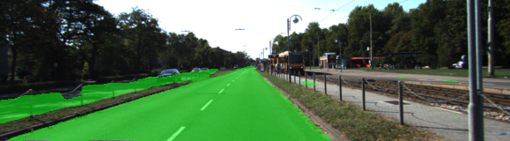
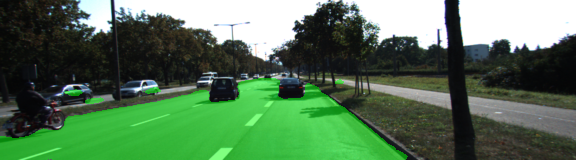

# Semantic Segmentation
### Introduction
In this project, you'll label the pixels of a road in images using a Fully Convolutional Network (FCN).

### Setup
##### Frameworks and Packages
Make sure you have the following is installed:
 - [Python 3](https://www.python.org/)
 - [TensorFlow](https://www.tensorflow.org/)
 - [NumPy](http://www.numpy.org/)
 - [SciPy](https://www.scipy.org/)
##### Dataset
Download the [Kitti Road dataset](http://www.cvlibs.net/datasets/kitti/eval_road.php) from [here](http://www.cvlibs.net/download.php?file=data_road.zip).  Extract the dataset in the `data` folder.  This will create the folder `data_road` with all the training a test images.

### Start
##### Implement
Implement the code in the `main.py` module indicated by the "TODO" comments.
The comments indicated with "OPTIONAL" tag are not required to complete.

##### Hyperparameters
- keep_prob: 0.5
- learning_rate: 0.0005
- epochs: 2
- batch_size: 1


##### Run
Run the following command to run the project:
```
python main.py
```
**Note** If running this in Jupyter Notebook system messages, such as those regarding test status, may appear in the terminal rather than the notebook.

### Results

1. All the unit tests have been passed.
2. The following files are included.
 - `helper.py`
 - `main.py`
 - `project_tests.py`
 - Newest inference images from `runs` folder

 
 
 
 
 

### Note
'kernel_initializer = tf.contrib.layers.xavier_initializer' didn't work well; I got loss over 30. Change
to 'tf.random_normal_initializer(stddev=0.01)' dropped the loss down to 1. But it still was not good.
It was found I was using AdadeltaOptimizer, resulting in 0.641. So, I trained again with AdamOptimizer applied
and ended up having below 0.01.


 ### Reference

 

 

 

 
