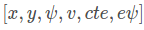
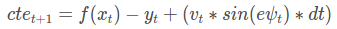

# CarND-Controls-MPC
Self-Driving Car Engineer Nanodegree Program

---

## Visual Output
[MPC-controlled Driving Video](https://youtu.be/ptBV-HJAnfs)

## Overview of the Model
The model keep track of the state of a vehicle. The state is represented as
, where x and y are positions of the vehicle, ψ is a multiplicative factor of the steering angle, δ , v is the velocity, cte is the cross track error, and eψ is the error of psi. 

Actuator inputs allow us to control the vehicle state. Most cars have three actuators: the steering wheel, the throttle pedal and the brake pedal. For simplicity we'll consider the throttle and brake pedals as a singular actuator, with negative values signifying braking and positive values signifying acceleration. This reduces the vehicle to two actuators , which we'll denote as δ for steering angle and a for acceleration (throttle/brake combined).


### Update equations


Lf measures the distance between the front of the vehicle and its center of gravity. The larger the vehicle, the slower the turn rate.

If you've driven a vehicle you're well aware at higher speeds you turn quicker than at lower speeds. This is why v is the included in the update.

On the topic of running a vehicle around in a circle, this is actually a good way to test the validity of a model! If the radius of the circle generated from driving the test vehicle around in a circle with a constant velocity and steering angle is similar to that of your model in the simulation, then you're on the right track.

The vehicle started at the origin, oriented at 0 degrees and was then simulated driving with a δ value of 1 degree and Lf​​ value of 2.67.

Finally, let's take a look at how the velocity, v is modeled:
v=v+a∗dt
where a can take value between and including -1 and 1.

#### Cross Track Error
We can express the error between the center of the road and the vehicle's position as the cross track error:

In this case cte at t can be expressed as the difference between the line and the current vehicle position y. Assuming the reference line is a 1st order polynomial f:
cte =f(x)−y

#### Orientation Error
now let’s take a look at the orientation error:

The update rule is essentially the same as ψ.
eψ is the desired orientation subtracted from the current orientation.

​We already know ψ, because it’s part of our state. We don’t yet know ψdes - all we have so far is a polynomial to follow. ψdes can be calculated as the tangential angle of the polynomial f evaluated at x, arctan(f′(x)). f′ is the derivative of the polynomial.

### Preprocess waypoints, vehicle state
The global positions of the waypoints and vehicles need to be converted into car coordinates. To do so, I apply equations that I used in P3, which are the following:
$ x_c = (ptsx - px) * cos(ψ) + (ptsy - py) * sin(ψ) $
$ y_c = (ptsy - py) * cos(ψ) - (ptsx - px) * sin(ψ) $
where ptsx and ptsy are global positions of the waypoints, px and py are global positions of the vehicle. x_c and y_c are inputs to polyfit, returning coeffients of a fit, f(x).


px = v * dt
ψ = - v / Lf * δ * dt
cte = f(0)
eψ = arctan(f'(0))

### Prediction horizon
The prediction horizon is the duration over which future predictions are made, which is referred to this as T. T is the product of two other variables, N and dt. N is the number of timesteps in the horizon. dt is how much time elapses between actuations. In my case, if N is 20 and dt is 0.05, then T becomes 1 second. T should be as large as possible, while dt should be as small as possible.

The goal of Model Predictive Control is to optimize the control inputs: [\psi,{a}]. An optimizer will tune these inputs until a low cost vector of control inputs is found. The length of this vector is determined by N. 

A good approach to setting N, dt, and T is to first determine a reasonable range for T and then tune dt and N appropriately, keeping the effect of each in mind.


## Dependencies

* cmake >= 3.5
 * All OSes: [click here for installation instructions](https://cmake.org/install/)
* make >= 4.1
  * Linux: make is installed by default on most Linux distros
  * Mac: [install Xcode command line tools to get make](https://developer.apple.com/xcode/features/)
  * Windows: [Click here for installation instructions](http://gnuwin32.sourceforge.net/packages/make.htm)
* gcc/g++ >= 5.4
  * Linux: gcc / g++ is installed by default on most Linux distros
  * Mac: same deal as make - [install Xcode command line tools]((https://developer.apple.com/xcode/features/)
  * Windows: recommend using [MinGW](http://www.mingw.org/)
* [uWebSockets](https://github.com/uWebSockets/uWebSockets)
  * Run either `install-mac.sh` or `install-ubuntu.sh`.
  * If you install from source, checkout to commit `e94b6e1`, i.e.
    ```
    git clone https://github.com/uWebSockets/uWebSockets 
    cd uWebSockets
    git checkout e94b6e1
    ```
    Some function signatures have changed in v0.14.x. See [this PR](https://github.com/udacity/CarND-MPC-Project/pull/3) for more details.
* Fortran Compiler
  * Mac: `brew install gcc` (might not be required)
  * Linux: `sudo apt-get install gfortran`. Additionall you have also have to install gcc and g++, `sudo apt-get install gcc g++`. Look in [this Dockerfile](https://github.com/udacity/CarND-MPC-Quizzes/blob/master/Dockerfile) for more info.
* [Ipopt](https://projects.coin-or.org/Ipopt)
  * Mac: `brew install ipopt`
  * Linux
    * You will need a version of Ipopt 3.12.1 or higher. The version available through `apt-get` is 3.11.x. If you can get that version to work great but if not there's a script `install_ipopt.sh` that will install Ipopt. You just need to download the source from the Ipopt [releases page](https://www.coin-or.org/download/source/Ipopt/) or the [Github releases](https://github.com/coin-or/Ipopt/releases) page.
    * Then call `install_ipopt.sh` with the source directory as the first argument, ex: `bash install_ipopt.sh Ipopt-3.12.1`. 
  * Windows: TODO. If you can use the Linux subsystem and follow the Linux instructions.
* [CppAD](https://www.coin-or.org/CppAD/)
  * Mac: `brew install cppad`
  * Linux `sudo apt-get install cppad` or equivalent.
  * Windows: TODO. If you can use the Linux subsystem and follow the Linux instructions.
* [Eigen](http://eigen.tuxfamily.org/index.php?title=Main_Page). This is already part of the repo so you shouldn't have to worry about it.
* Simulator. You can download these from the [releases tab](https://github.com/udacity/self-driving-car-sim/releases).
* Not a dependency but read the [DATA.md](./DATA.md) for a description of the data sent back from the simulator.


## Basic Build Instructions

1. Clone this repo.
2. Make a build directory: `mkdir build && cd build`
3. Compile: `cmake .. && make`
4. Run it: `./mpc`.