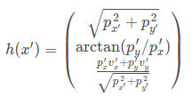

# Project 1: Extended Kalman Filter

This project is about a system that tracks objects like vehicles and/or pedestrians with their position and velocity with Extended Kalman Filter (EKF) applied. There are two types of input data from RADAR and LIDAR sensors. The data from the RADAR sensor consists of a tuple of (range, angle, range rate), whereas the other consists of a tuple of (position x, position y). The state of the filter is represented as a tuple of (position x, position y, velocity x, velocity y), given the conversion of the polar coordinate into cartesian for the RADAR data.

The EKF systrem is divided into prediction and measurement update. The prediction is the motion process where the state is convoluted through the state transition matrix F, while the measurement upate corrects the state w.r.t. the measurement via the update matrix H, where Jacobian matrix Hj instead of H is used for the RADAR data. Whichever of RADAR and LIDAR data is available, it applies first to EKF.

---

## Dependencies

* cmake >= 3.5
 * All OSes: [click here for installation instructions](https://cmake.org/install/)
* make >= 4.1
  * Linux: make is installed by default on most Linux distros
  * Mac: [install Xcode command line tools to get make](https://developer.apple.com/xcode/features/)
  * Windows: [Click here for installation instructions](http://gnuwin32.sourceforge.net/packages/make.htm)
* gcc/g++ >= 5.4
  * Linux: gcc / g++ is installed by default on most Linux distros
  * Mac: same deal as make - [install Xcode command line tools]((https://developer.apple.com/xcode/features/)
  * Windows: recommend using [MinGW](http://www.mingw.org/)

## Basic Build Instructions

1. Clone this repo.
2. Make a build directory: `mkdir build && cd build`
3. Compile: `cmake .. && make`
4. Run it: `./ExtendedKF path/to/input.txt path/to/output.txt`. You can find
   some sample inputs in 'data/'.
    - eg. `./ExtendedKF ../data/sample-laser-radar-measurement-data-1.txt ../data/output1.txt`

Whenever the code is modified, repeat Steps 3 and 4.

## Editor Settings

The code follows
* indent using spaces
* set tab width to 2 spaces (keeps the matrices in source code aligned)

## Code Style

Please (do your best to) stick to [Google's C++ style guide](https://google.github.io/styleguide/cppguide.html).

## Outputs

When we run the app (which corresponds to Step 4 in Basic Build Instructions), it returns:

Fig 1 shows the position tracking result from data-1 fed into my EKF system. As can be seen, overall positions are well estimated besides the very first estimate. It results in RMSE = [0.02896, 0.0292602]

Fig 2 shows the velocity tracking result from data-1. The velocity represents the hidden state. As can be seen, velocity estimates generally follow ground truth, which results in RMSE = [0.345062, 0.411241].

## Attention

In the radar update step, the Jacobian matrix Hj (Jacobian matrix) is used to calculate S, K and P, but **not y**. To calculate y, we use the following equations that map the predicted location x' from Cartesian coordinates to polar coordinates:

Therefore, for lidar we can use the H matrix for calculating y, S, K and P. For radar Hj can be used to calculate S, K and P.
