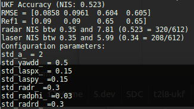
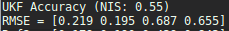
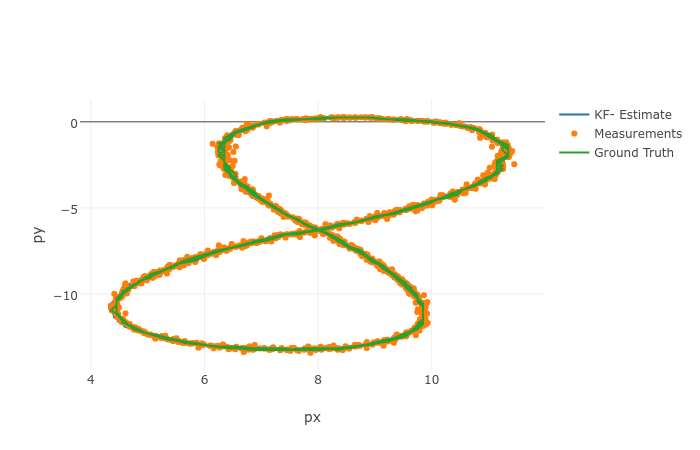
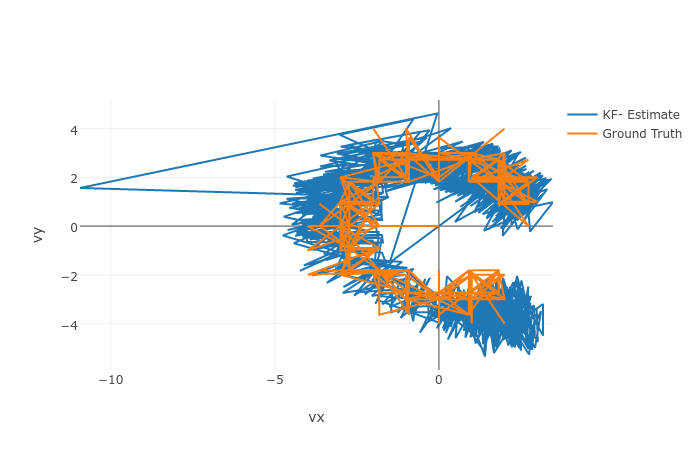

# P2: Unscented Kalman Filter

The project "unscented Kalman filter (UKF)" is based on the same structure as the extended Kalman filter. It uses a main file that calls a function called ProcessMeasurement. Anything important happens in this function. The function is part of the class UKF.

UKF consists of the prediction with a process model and the update with a measurement model. The prediction is characterized generating sigma points, predicting sigma points, and predicting mean and covariance. The update updates the state and the covariance based on the measurement from RADAR and LIDAR sensors.

---

## Dependencies

* cmake >= v3.5
* make >= v4.1
* gcc/g++ >= v5.4

## Basic Build Instructions

1. Clone this repo.
2. Make a build directory: `mkdir build && cd build`
3. Compile: `cmake .. && make`
4. Run it: `./UnscentedKF path/to/input.txt path/to/output.txt`. You can find
   some sample inputs in 'data/'.
    - `./UnscentedKF ../data/sample-laser-radar-measurement-data-1.txt ukfoutput1.txt`
    - `./UnscentedKF ../data/sample-laser-radar-measurement-data-2.txt ukfoutput2.txt`

Whenever the code is modified, repeat Steps 3 and 4.

## Editor Settings

We've purposefully kept editor configuration files out of this repo in order to
keep it as simple and environment agnostic as possible. However, we recommend
using the following settings:

* indent using spaces
* set tab width to 2 spaces (keeps the matrices in source code aligned)

## Code Style

Please stick to [Google's C++ style guide](https://google.github.io/styleguide/cppguide.html) as much as possible.

## Outputs

When we run `./UnscentedKF ../data/sample-laser-radar-measurement-data-1.txt ukfoutput1.txt`, it returns:

and `./UnscentedKF ../data/sample-laser-radar-measurement-data-2.txt ukfoutput2.txt` returns

Fig 1 shows the position tracking result from data-1 fed into my UKF system. As can be seen, overall positions are well estimated besides the very first estimate. 

Fig 2 shows the velocity tracking result from data-1. The velocity represents the hidden state. As can be seen, velocity estimates generally follow ground truth.

## Suggestions

If you see the velocity errors are just a little bit too high, please do
- Check that noise models (i.e. R for each sensor type, and Q) are correctly modeling the respective sensor types - refer back to the Udacity lectures for the correct models to use.
- Check the initializations of important matrices are correct (i.e. F, H and P) - look for typos, and outright errors. Make sure the values are sensible.